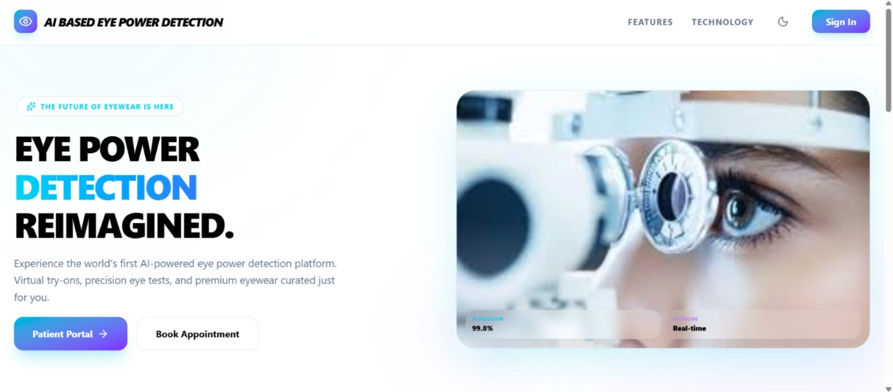
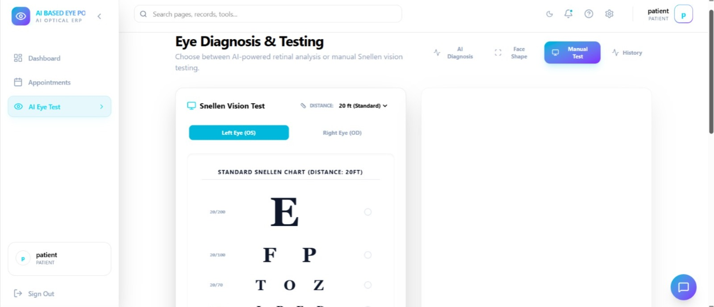
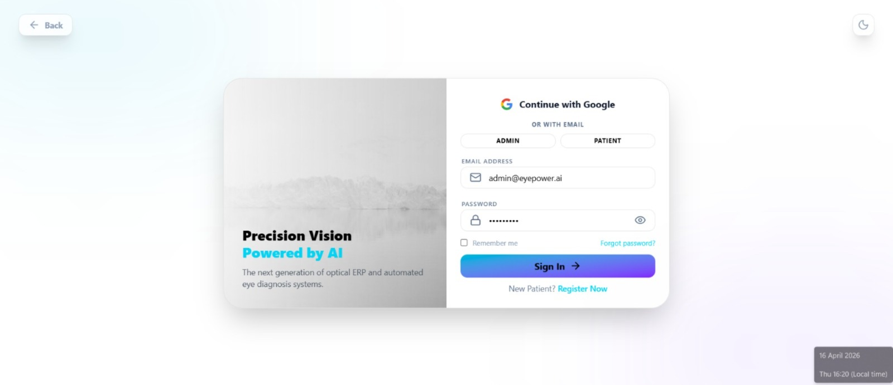
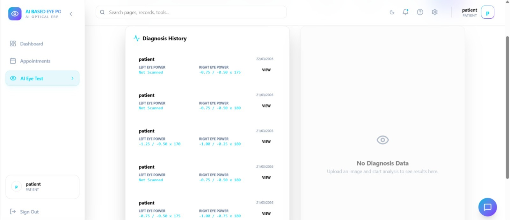
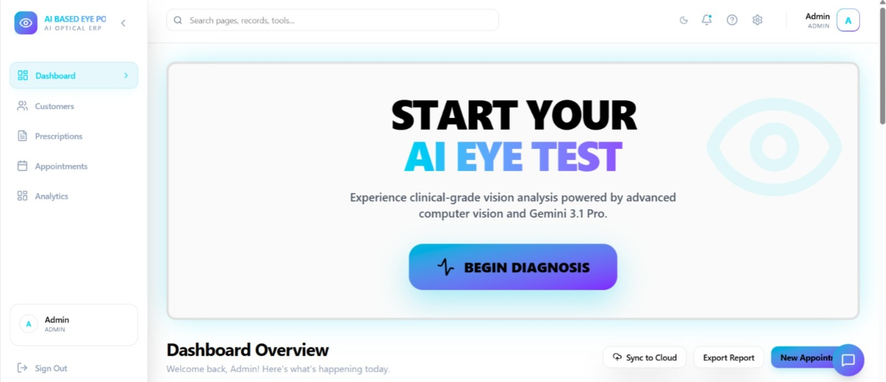

# 👁️ AI Eye Strain Detection System

A Python & OpenCV app that uses your webcam to monitor blink rate and
screen-focus duration in real time, detects signs of digital eye strain,
and reminds you to take breaks.

## Features
- Real-time webcam eye tracking
- Blink rate monitoring
- Screen-focus duration tracking
- Break alerts based on the 20-20-20 rule
  (every 20 minutes, look 20 feet away for 20 seconds)

## Tech Stack
Python · OpenCV

## Installation
git clone https://github.com/kadamsahil844-Aq/ai-eye-strain-detection-system
cd ai-eye-strain-detection-system
pip install opencv-python
python <your-file-name>.py

## Usage
1. Run the script and allow webcam access.
2. Sit facing the screen with good lighting.
3. Press `q` to quit.

## Screenshots

## Future Improvements
- Dashboard with daily eye-health stats
- Adjustable alert thresholds
- Desktop notifications

## Disclaimer
Educational project, not medical advice.

## Author
Sahil Kadam · [https://www.linkedin.com/in/sahil-kadam844]
